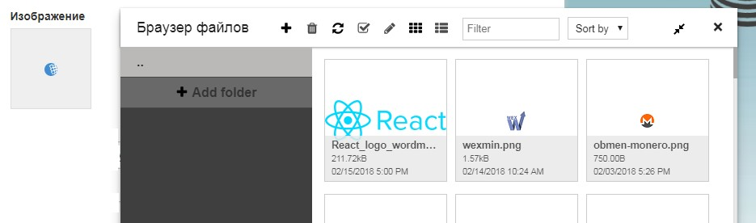

# yii2-jodit
Jodit widget for Yii2

Installation
------------

The preferred way to install this extension is through [composer](http://getcomposer.org/download/).

Either run

```
php composer.phar require --prefer-dist jodit/yii2-jodit "*"
```
or 
```
composer require --prefer-dist jodit/yii2-jodit
```
or add

```
"jodit/yii2-jodit": "*"
```

to the require section of your `composer.json` file.

Configure
-----
Add to config file (config/web.php or common\config\main.php)

```php
'modules' => [
	'jodit' => 'yii2jodit\JoditModule',
],
```

or if you want to change the upload directory. to path/to/uploadfolder default value @webroot/uploads

```php
'modules' => [
	'jodit' => [
		'class' => 'yii2jodit\JoditModule',
		'extensions'=>['jpg','png','gif'],
		'root'=> '@webroot/uploads/',
		'baseurl'=> '@web/uploads/',
		'maxFileSize'=> '20mb',
		'defaultPermission'=> 0775,
	],
],
```
[All connector's options](https://github.com/xdan/jodit-connectors)

> note: You need to create uploads folder and chmod and set security for folder upload reference:[Protect Your Uploads Folder with `.htaccess`](http://tomolivercv.wordpress.com/2011/07/24/protect-your-uploads-folder-with-htaccess/), []How to Setup Secure Media Uploads](http://digwp.com/2012/09/secure-media-uploads/)

Usage
-----

Once the extension is installed, simply use it in your code by  :

```php
<?=$form->field($model, 'content')->widget(\yii2jodit\JoditWidget::className(), [
    'settings' => [
        'buttons'=>[
            'bold', 'italic', 'underline', '|', 'ul', 'ol', '|', 'image', '|', 'hr',
        ],
    ],
]);?>
```
[All Jodit's options](https://xdsoft.net/jodit/doc/)

or not use ActiveField
```php
<?= \yii2jodit\JoditWidget::widget([
    'model' => $model,
    'attribute' => 'content'
]) ?>
```

Image uploader
--------------

editors config:

```php
<?=$form->field($model, 'content')->widget(\yii2jodit\JoditWidget::className(), [
    'settings' => [
        'height'=>'250px',
        'enableDragAndDropFileToEditor'=>new \yii\web\JsExpression("true"),
    ],
]);?>
```


Icon Picker
-----------
```php
<?=$form->field($model, 'icon')->widget(\yii2jodit\JoditIconPickerWidget::className(), [
	"path" => 'wp-content/plugins/exchangers-monitor/images/systemlogo'
]);?>
```



License
-----
This package is available under `MIT` License.